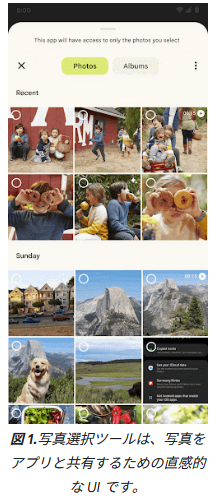
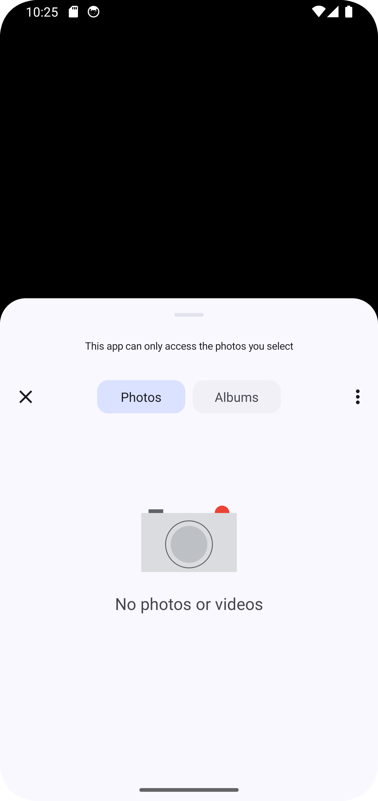

<!--
title:   【Android】フォトピッカーにオーバーフローメニュー(三点リーダー)を表示したい
tags:    Android,Kotlin,XML
id:      04f5e8d019021b8fc74c
private: true
-->
# 新しいフォトピッカーについて
[こちら](https://developer.android.com/training/data-storage/shared/photopicker)を参照してください。  
Android 13より新たに追加されたインターフェースとなっています。  
画面遷移が行われないのでUX観点的に非常に良いですね。

# TL;DR
```Kotlin
ActivityResultContracts.PickVisualMedia()
```
ではなく、
```Kotlin
ActivityResultContracts.GetContent()
```
を用いる。

# オーバーフローメニュー出したい
  
上記は公式ドキュメントに載っているものですが、  
インターフェース上部にオーバーフローメニューがあるのがお分かりでしょうか？  
これを表示するだけなら簡単では？と思って気軽に試そうと思ったのですが実現方法の調査に想像より苦戦しました。 

そして、何より **公式ドキュメントに載っていない！！！**  
公式サイトに載ってるんだkら出来るのでは？と思ったらそれのやり方が全然明記されてません...。  
(もし見つけた方いたら教えてください...)

# オーバーフローメニューの表示方法
```Kotlin
/*オーバーフローメニューが表示されないフォトピッカー*/
val normalPhotoPicker = registerForActivityResult(ActivityResultContracts.PickVisualMedia()) { uri ->
}

/*オーバーフローメニューが表示されるフォトピッカー*/
val pickMedia = registerForActivityResult(ActivityResultContracts.GetContent()) { uri ->
}
binding.btnStart.setOnClickListener {
    pickMedia.launch("image/*")
}
```

ActivityResultContracts.GetContent()を用いるかActivityResultContracts.PickVisualMedia()の違いです。  
上記の方法を用いて実行したものが以下です。  
  
しっかり表示されているのが分かりますね。  
恐らく違いですが、Intentの設定だと思われます。  
# Intentの違い  
下記は、PickVisualMediaクラスのソースコードです。(一部省略)
```Kotlin
open class PickVisualMedia : ActivityResultContract<PickVisualMediaRequest, Uri?>() {
    companion object {
        /**
            * Check if the current device has support for the photo picker by checking the running
            * Android version or the SDK extension version.
            *
            * Note that this does not check for any Intent handled by
            * [ACTION_SYSTEM_FALLBACK_PICK_IMAGES].
            */
        @SuppressLint("ClassVerificationFailure", "NewApi")
    }
    ...
    @CallSuper
    override fun createIntent(context: Context, input: PickVisualMediaRequest): Intent {
        // Check if Photo Picker is available on the device
        return if (isSystemPickerAvailable()) {
            Intent(MediaStore.ACTION_PICK_IMAGES).apply {
                type = getVisualMimeType(input.mediaType)
            }
        }
        ...
}
```

対して、GetContentクラスのソースコードは以下です。(一部省略)
```Kotlin
open class GetContent : ActivityResultContract<String, Uri?>() {
    @CallSuper
    override fun createIntent(context: Context, input: String): Intent {
        return Intent(Intent.ACTION_GET_CONTENT)
            .addCategory(Intent.CATEGORY_OPENABLE)
            .setType(input)
    }
    ...
}
```
* PickVisualMedia -> MediaStore.ACTION_PICK_IMAGES
* GetContent -> Intent.ACTION_GET_CONTENT

となっており、Intent生成時に使用する引数が異なっています。  

この辺りを上手い具合に利用して、自分なりのPickVisualMediaクラスを作成すればもっと容易になるかもしれませんね！